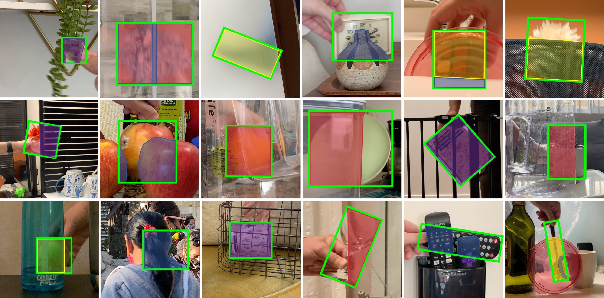

# HOOT Benchmark Official Toolkit

This is the official toolkit for HOOT: Heavy Occlusions for Object Tracking Benchmark, which focuses on single-object tracking under heavy occlusions. The benchmark provides dense occlusions annotations such as frame-lavel occlusion labels and occluder masks, as well as occluder types for each mask.



If you use the HOOT Benchmark or the toolkit for a research publication, please cite our paper:

```Bibtex
@inproceedings{sahin2023hoot,
  title={HOOT: Heavy Occlusions in Object Tracking Benchmark},
  author={Sahin, Gozde and Itti, Laurent},
  booktitle={Proceedings of the IEEE/CVF Winter Conference on Applications of Computer Vision},
  pages={4830--4839},
  year={2023}
}
```

## Installation

1. Clone the repo from github
   ```sh
   git clone https://github.com/gzdshn/hoot-toolkit.git
   ```
2. Setup your environment:

   _If you're installing `hoot-toolkit` in an existing conda environment for your project, skip to step 4._

   To create a new conda environment using the provided `environment.yml` file
   ```sh
   conda env create -n my-hoot-env -f hoot-toolkit/environment.yml
   ```

3. Enter your conda environment
   ```sh
   conda activate my-hoot-env
   ```
4. Install the `hoot-toolkit` CLI
   ```sh
   pip install hoot-toolkit/
   ```
   If you would like to edit the `hoot-toolkit` code, use the editable pip install option (`-e`) above.


## Getting Started

1. View the CLI command listing
   ```sh
   hoot --help
   ```
2. View help for a subcommand
   ```sh
   hoot download --help
   ```

## Downloading HOOT
   
   ```sh
   hoot download --dest /path/to/hoot 
                 --version v1_0-HD  ## dataset version (HD by default)
                 --test-only        ## downloads only test split
                 --clean            ## overwrites already downloaded zips
                 --extract          ## extracts zips after download
                 --remove-archives  ## deletes the zip file after extraction to clean up space
   ```

To download any specific subset of HOOT that includes specific properties (e.g. only videos with semi-transparent occluders), consider writing a quick filter (check `src/hoot/downloader.py:89`) to do so before you run the above command. 

## Visualize HOOT
   
   ```sh
   hoot visualize --dir /path/to/hoot 
                  --dest /visuals/output/path  ## to save visualization images
                  --video apple-003 ## to visualize a specific video 
   ```

   Directory to save (`--dest`) is optional, as well as the video (`--video`). If not given a specific video, the `visualize` command will visualize all videos in the dataset.

## Usage of make-archive
   
`make-archive` is a tool we have used to package HOOT data in individual video zips for distribution. It parses the local data folder and creates zips for each video under each object class, while writing a `metadata.json` that holds information like video id, download file size, split, tags, etc. This `metadata.json` file is then used in the downloader. An example on how to use the make-archive tool is below:

   ```sh
   hoot make-archive --dir data/hoot_v1 
                     --dest data/hoot_v1_export 
                     --version 1.0 
                     --clean=True
   ```

While you won't need `make-archive` for using HOOT, if you have a dataset you would like to distribute this way, please feel free to use the archiver and downloader tools from this repo. If you do, please link to `hoot-toolkit` as acknowledgement.